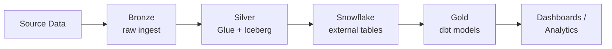

<div align="center">

# rajat yadav

`data engineer in training` · `sydney, au`


</div>

<br>

```bash
rajat@sydney:~$ whoami
```
```
B.Tech CSE grad building cloud data pipelines from scratch.
I take messy CSVs and turn them into Bronze → Silver → Gold
tables that actually answer questions.
```

```bash
rajat@sydney:~$ cat currently.md
```
```md
- Shipping:  Chart Selector API (FastAPI → Docker → AWS ECS Fargate)
- Learning:  Spark internals (Catalyst, Tungsten, AQE, shuffle & skew)
- Open to:   data eng collabs, code reviews, mentorship chats
```

<br>

## pipeline

*(the shape most of my projects take)*



<br>

## stack

<table>
<tr>
<td valign="top" width="33%">

**Languages**
<br>


</td>
<td valign="top" width="33%">

**Data & Cloud**
<br>


</td>
<td valign="top" width="33%">

**Backend & Tools**
<br>


</td>
</tr>
</table>

<br>

## projects

| | |
|---|---|
| **Chart Selector API** | FastAPI service · 11 chart types · rule-based selection · deployed on ECS Fargate |
| **E-Commerce Medallion Pipeline** | RDS → Glue/PySpark → Iceberg → Snowflake → dbt Gold models |
| **NYC Taxi Data Pipeline** | ~2.96M rows · incremental Glue loads · Iceberg Silver · 6 dbt Gold models |

<br>

<div align="center">


<br>

[](https://linkedin.com/in/rajat-yadav-73b853289)
[](mailto:rajatt.yadaavv@gmail.com)

</div>
